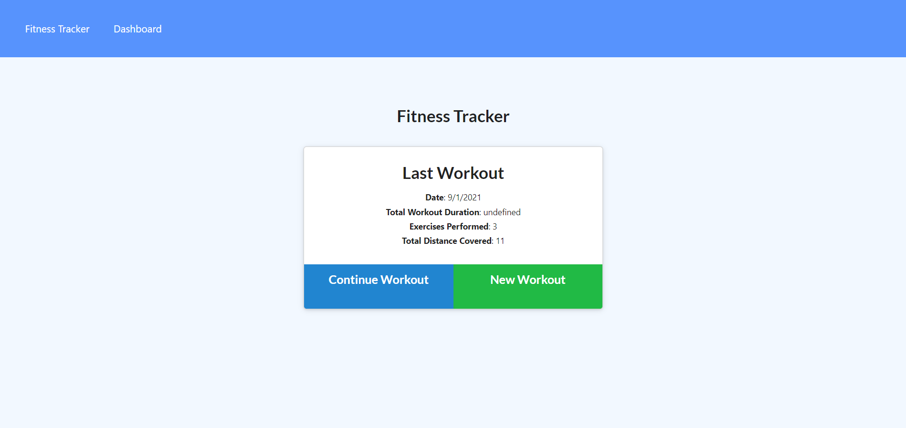
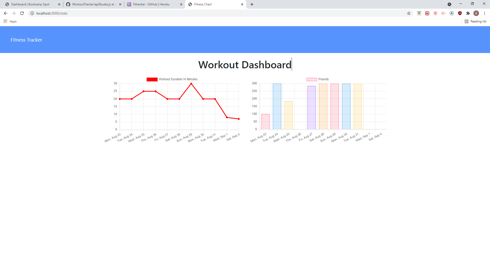

# Workout Tracker

## Description

This application allows the user to add and track their workouts.

## Table of Contents

- [Installation](#Installation)
- [Usage](#Usage)
- [License](#License)
- [Questions](#Questions)

## Installation

You can view the deployed site here https://fittracker.herokuapp.com/

## Usage

The User can click on the "New Workout" or "Continue Workout" buttons and add the workout to the dashboard.

## License

MIT

## Questions

For additional information please contact me via GitHub at [https://github.com/codeb-a](https://github.com/codeb-a) or via email at [brandonakers729@gmail.com](mailto:brandonakers729@gmail.com?subject=[GitHub]%README%Generator).
